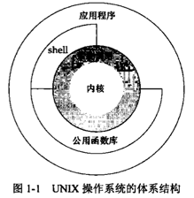

## 《UNIX环境高级编程（第三版）》

从严格意义上说，可将操作系统定义为一种软件，它控制计算机硬件资源，提供程序运行环境。我们通常将这种软件称为 **内核**，内核的接口被称为 **系统调用**。

创建文件名时推荐使用字母、数字、句点(.)、横短线(-)和下划线(_)，创建新目录时会自动创建两个文件名：`.` 和 `..` ，点指向当前目录，点点指向父目录。
在最高层次的的目录中，点与点点相同。

由斜线分隔的一个或多个文件名组成的序列构成路径名，以斜线开的路径名称为绝对路径名，否则称为相对路径名，相对路径名指向相对于当前目录的文件。